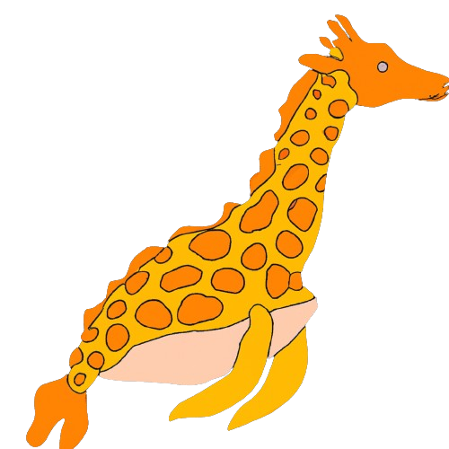

# ג'ירפת ים

## נסו להביא את הג'ירפת ים למקלחת ולהתגבר על כל המכשולים בדרך

לפי ג'יפיטי:

## ג'ירפת הים היא יצור ימי גדול ומרשים שהוא לא יצור אמיתי כמו ג'ירפה. זהו סוג של סנפיר ים המזוהה בעיקר עם האורך המרשים של צווארו

ג'ירפות הים נמצאות במים החמים והקרובים לחופים באזורים כמו המפרץ המערבי של ערב הסעודית, ים סוף, ים אדום ואזורים אחרים באוקיינוס ההודי ובאזור האטלנטי של המפרץ המקסיקני. הן מתגוררות בעומקים של עד מאות מטרים מתחת למים.

